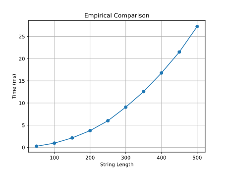

# Programming Assignment 3: Highest Value Longest Common Sequence

COP4533 - Algorithm Abstraction and Design

Daniel Li - 99157575

## Running

This program requires a recent version of Python (tested with Python 3.14.3).

```
./hvlcs.py example.in
```

Compare with `example.out`.

## Empirical Comparison

Note that due to the use of string construction instead of backtracking,
the runtime of this implementation is actually `O(na*nb*min(na,nb)^2)`,
assuming string concatenation is quadratic on the length of the string.

The following graph was generated with `./hvlcs.py --graph`.
Note that running this command will overwrite `graph.svg`.
Both strings have the same length, and are are generated randomly
from an alphabet of 26 characters, each corresponding to the values 1 to 26.



## Recurrence Equation

Let `S(i, j)` be the value of the HVLCS of
the first `i` characters in `A` and the first `j` characters in `B`.

As a base case, `S(i, 0) = 0` and `S(0, j) = 0` for any `i` or `j`,
since no common sequence can be formed with an empty string.

Consider `S(i, j)`. There are two cases:

**Case 1. `A[i] = B[j]`**

Suppose `A[i]` and `B[j]` are not matched.
Then either they are not present in the HVLCS or either `A[i]` or `B[j]`
is matched with an earlier character in the other string.
If they are not present in the HVLCS, they can be appended to the sequence
to obtain a higher-value sequence.
If either `A[i]` or `B[j]` is matched with an earlier character,
they can be matched with each other instead
to obtain a sequence with the same value.
Thus `A[i]` and `B[j]` are matched:

```
S(i, j) = S(i-1, j-1) + value(A[i])
```

where `value()` returns the value of a character.

**Case 2. `A[i] ≠ B[j]`**

Thus `A[i]` and `B[j]` cannot be matched.
We can try removing each of `A[i]` and `B[j]`,
perform the match again, and see which value is greater:

```
S(i, j) = max(S(i-1, j), S(i, j-1))
```

**Final Equation:**

```
S(i, j) = { 0                             if i = 0 or j = 0
            S(i-1, j-1) + value(A[i])     if A[i] = B[j]
            max(S(i-1, j), S(i, j-1))     if A[i] ≠ B[j] }
```

## Big-Oh

We define the following:

* `a` and `b` are the input strings with lengths `na` and `nb` respectively.
* `+` denotes componentwise addition.
* `value()` returns the value of a character or the value component of a tuple.
* `length()` returns the length of a string or the length component of a tuple.
* `maxval()` returns the tuple with the greater value component.

```
m = 2D array with indices [0...na][0...nb]
    of tuples (value, length)

for i in 0...na:
  for j in 0...nb:
      m[i][j] = (0, 0)

for i in 1...na:
    for j in 1...nb:
        if a[i] == b[j]:
            m[i][j] = m[i-1][j-1] + (value(a[i]), 1)
        else:
            m[i][j] = maxval(m[i-1][j], m[i][j-1])

return length(m[na][nb])
```

The helper functions can reasonably be expected to run in constant time.
The runtime of this algorithm is `O(na*nb)`.
